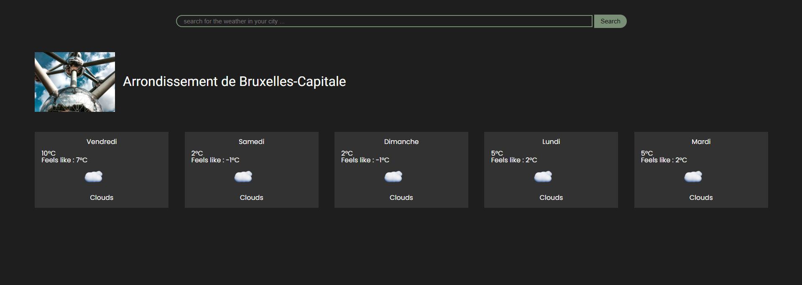

# ☁️ Weather App ☁️

Check the current weather on any city on the planet with this [app](https://casl0x.github.io/weather-app/). 

## Features
1. User's ability to search cities
2. Actual and felt temperature

## Used technology 

    
⌨️ Language

        <option>HTML</option>
        <option>CSS - Sass</option>
        <option>Javascript </option>

    
🔍 API

        <option>https://openweathermap.org/</option>
        <option>https://nominatim.org/release-docs/latest/api/Overview/</option>
        <option>https://unsplash.com/documentation</option>

## To upgrade
- Compare the weather in multiple cities
- Display a line graph of temperature